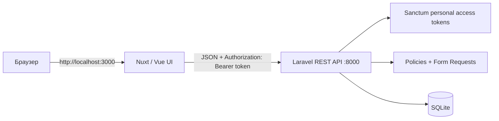

# Laravel + Nuxt To-do

Полноценное тестовое To-Do приложение: REST API на Laravel, интерфейс на Nuxt/Vue, Bearer-авторизация через Sanctum, ролевой доступ и SQLite. Проект закрывает обязательный сценарий задания и дополнительные пункты, которые упрощают проверку решения.

## Что реализовано

- вход и выход пользователя через Laravel Sanctum Personal Access Token;
- CRUD задач без перезагрузки страницы;
- статусы `pending`, `in_progress`, `completed`, дедлайн и описание;
- фильтрация, сортировка, поиск и пагинация, включая поиск владельца для администратора;
- роли `admin` и `user`, серверные политики owner/admin;
- единый JSON-формат ошибок API и отображение ошибок в интерфейсе;
- loading-, empty- и error-состояния, адаптивная верстка;
- backend- и frontend-тесты критичных сценариев;
- Docker Compose и отдельное описание API.

## Стек

| Слой | Технологии |
|---|---|
| Backend | PHP 8.2+, Laravel 12, Eloquent, Sanctum 4 |
| Frontend | Node.js 22.12+, Nuxt 4, Vue 3, Pinia 3, TypeScript |
| Данные | SQLite, Laravel migrations/seeders/factories |
| Тесты | PHPUnit 11, Vitest 4, Vue Test Utils |
| Запуск | Docker Compose v2, multi-stage frontend image |

## Архитектура



- `frontend/` — Nuxt-приложение на Vue 3 и Composition API. Отвечает за маршруты, auth-состояние, формы и UI-состояния.
- `backend/` — Laravel API. Контроллеры остаются тонкими; валидация находится в Form Request, сериализация — в API Resources, доступ — в `TaskPolicy`.
- SQLite хранит данные локально. В Docker база лежит в именованном volume и переживает перезапуск контейнеров.
- Браузер обращается к API напрямую по `http://localhost:8000/api`; имя Docker-сервиса намеренно не используется как публичный URL.

## Быстрый запуск в Docker

Нужен Docker Engine с Compose v2.

```bash
cp .env.example .env
docker compose up --build
```

После успешного старта:

- приложение: <http://localhost:3000>;
- API: <http://localhost:8000/api>;
- health check Laravel: <http://localhost:8000/up>.

При первом запуске backend автоматически создаёт SQLite-файл, выполняет `migrate --force` и заполняет новую базу тестовыми данными. При последующих стартах выполняются только новые миграции — пользовательские данные не сбрасываются.

Остановка с сохранением базы:

```bash
docker compose down
```

Полный сброс базы и повторное заполнение сидами:

```bash
docker compose down -v
docker compose up --build
```

## Тестовые пользователи

| Роль | Email | Пароль | Доступ |
|---|---|---|---|
| Admin | `admin@example.com` | `password` | Все задачи, редактирование и удаление любой задачи |
| User | `user@example.com` | `password` | Только собственные задачи |

Сиды также создают несколько задач с разными статусами и дедлайнами.

## Локальный запуск

### Требования

- PHP 8.2+ с расширением `pdo_sqlite`;
- Composer 2;
- Node.js 22.12+ и npm;
- свободные порты `8000` и `3000`.

### Backend

```bash
cd backend
composer run setup
composer run dev
```

Скрипт `setup` устанавливает зависимости, создаёт `.env` и SQLite-файл, генерирует `APP_KEY`, запускает миграции и сиды. API будет доступен на <http://127.0.0.1:8000/api>.

Эквивалентная ручная установка:

```bash
cd backend
composer install
cp .env.example .env
touch database/database.sqlite
php artisan key:generate
php artisan migrate --seed
php artisan serve --host=127.0.0.1 --port=8000
```

### Frontend

В отдельном терминале:

```bash
cd frontend
cp .env.example .env
npm ci
npm run dev
```

Nuxt будет доступен на <http://localhost:3000>. По умолчанию frontend использует `http://localhost:8000/api`; значение можно переопределить переменной `NUXT_PUBLIC_API_BASE`. Локальный `.env.example` также включает `NUXT_PUBLIC_DEMO_MODE=true`: форма входа предзаполняется, а под ней отображаются быстрые ссылки на тестовые аккаунты.

## Миграции и сиды

В Docker:

```bash
docker compose exec backend php artisan migrate
docker compose exec backend php artisan db:seed
docker compose exec backend php artisan migrate:fresh --seed
```

Локально те же команды выполняются из каталога `backend/` без префикса `docker compose exec backend`.

> `DatabaseSeeder` восстанавливает демонстрационный набор задач. Не запускайте его поверх нужных локальных данных; для предсказуемого полного сброса используйте `migrate:fresh --seed`.

## Авторизация

Выбран Bearer-вариант Laravel Sanctum:

1. `POST /api/auth/login` проверяет email/password и возвращает Personal Access Token.
2. Frontend хранит токен в `localStorage` и добавляет к защищённым запросам заголовок `Authorization: Bearer <token>`.
3. `POST /api/auth/logout` удаляет текущий токен.
4. Ответ `401` очищает локальное auth-состояние и отправляет пользователя на страницу входа.

Cookie/CSRF handshake для этого режима не нужен. Авторизация и ограничения доступа проверяются на backend; скрытие недоступных UI-действий — только дополнительный UX-слой, а не замена политики.

## API

Все endpoint, кроме login, требуют Bearer token.

| Метод | Endpoint | Назначение |
|---|---|---|
| `POST` | `/api/auth/login` | Вход и получение токена |
| `POST` | `/api/auth/logout` | Удаление текущего токена |
| `GET` | `/api/user` | Текущий пользователь |
| `GET` | `/api/tasks` | Список, поиск, фильтры, сортировка и пагинация |
| `POST` | `/api/tasks` | Создание задачи |
| `GET` | `/api/tasks/{id}` | Одна задача |
| `PUT/PATCH` | `/api/tasks/{id}` | Обновление владельцем или администратором |
| `DELETE` | `/api/tasks/{id}` | Удаление владельцем или администратором |

Параметры списка:

- `search` — поиск по заголовку и описанию;
- `status` — `pending`, `in_progress` или `completed`;
- `user_id` — фильтр по владельцу, доступный только администратору;
- `sort` — `due_date`, `status`, `created_at` или `user`;
- `direction` — `asc` или `desc`;
- `page` — номер страницы;
- `per_page` — от 1 до 100, по умолчанию 15.

Вместе со страницей данных API возвращает `summary` по всем доступным текущему пользователю задачам: общее количество, разбивку по статусам и число просроченных незавершённых задач. Для администратора ответ также содержит список владельцев для поискового фильтра.

Подробные payload, форматы ответов и cURL-примеры: [docs/api.md](docs/api.md).

## Ошибки API

API всегда отвечает JSON:

- `401` — отсутствующий, истёкший или неверный токен;
- `403` — действие запрещено политикой;
- `404` — endpoint или сущность не найдены;
- `422` — ошибки валидации в объекте `errors`;
- `500` — непредвиденная серверная ошибка без утечки деталей в production.

Пример ошибки валидации:

```json
{
  "message": "The title field is required.",
  "errors": {
    "title": ["The title field is required."]
  }
}
```

## Тесты

Backend:

```bash
cd backend
composer test
```

Frontend:

```bash
cd frontend
npm test
```

Проверка production-сборки frontend:

```bash
cd frontend
npm run build
```

## Реализованные дополнительные цели

- роли admin/user и серверные политики доступа;
- доступ администратора ко всем задачам, изоляция данных обычного пользователя;
- флаги `can.update` / `can.delete` в API и скрытие недоступных действий в UI;
- debounced-поиск с синхронизацией фильтров и страницы с query-параметрами URL;
- backend/frontend пагинация;
- feature-тесты API и frontend-тесты критичных состояний;
- подробная API-документация;
- воспроизводимый Docker Compose запуск с health checks и постоянным SQLite volume.

## Примечание о production

Docker-сценарий оптимизирован для быстрой проверки задания: frontend собирается в production `.output`, backend-образ устанавливает зависимости без `require-dev`, данные вынесены в volume. В реальном production вместо `artisan serve` следует использовать PHP-FPM с reverse proxy, задать постоянный секретный `APP_KEY`, выключить `APP_DEBUG` и подключить управляемую СУБД. Не включайте `NUXT_PUBLIC_DEMO_MODE`: его безопасное значение по умолчанию `false`, поэтому production-форма будет пустой и без подсказок тестовых аккаунтов.

## Структура проекта

```text
.
├── backend/                 Laravel REST API
├── frontend/                Nuxt / Vue приложение
├── docker/                  Dockerfiles и backend entrypoint
├── docs/                    API и дизайн-материалы
├── docker-compose.yml       Полный локальный стек
└── .env.example             Безопасные настройки Compose
```

## Диагностика

- Логи: `docker compose logs -f backend frontend`.
- Статус и health checks: `docker compose ps`.
- Если порты заняты, измените `BACKEND_PORT`, `FRONTEND_PORT` и согласованно обновите `NUXT_PUBLIC_API_BASE` в корневом `.env`.
